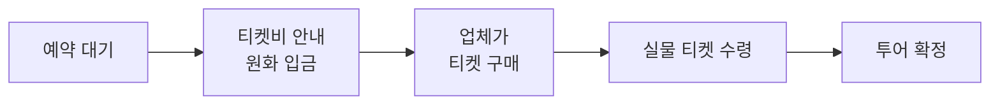

# D2 · 10/20(화) 로마 완벽 가이드

2026-09-21 · @Someone

## 최종 타임라인

투어 미팅 14:00 기준 일정이에요. 미팅시간은 전날 카톡으로 확정되니, 달라지면 아래 '미팅시간 변동 대응표'대로 호텔 출발 시각만 옮기면 됩니다.

| 시간 | 일정 | 이동 | 메모 |
| --- | --- | --- | --- |
| 08:15 | 기상 | - | 시차로 더 일찍 깨도 정상 |
| 08:45 | 호텔 조식 | - | 테라스에서 아침 햇볕 쬐기 |
| 09:45 | 호텔 출발 → 공화국 광장 | 도보 5\~7분 | 어깨·무릎 가리는 복장 |
| 09:55 | 산타 마리아 델리 안젤리 성당, 나이아디 분수 | - | 30분 |
| 10:25 | 산타 마리아 마조레로 이동 | 도보 약 12분 |  |
| 10:40 | 산타 마리아 마조레 | - | 40분, 보안검색 |
| 11:20 | Da Tudini 1969로 이동 | 도보 2\~3분 |  |
| 11:30 | 점심: Da Tudini 1969 | - | 55분, 11:30 예약 |
| 12:25 | 호텔로 이동 | 도보 12\~15분 | 비 오면 택시 |
| 12:40 | 호텔 휴식 | - | 낮잠 20분, 저녁까지 쓸 가방 완성 |
| 13:20 | 콜로세오역으로 이동 | 택시 15\~20분 | 미팅 40분 전 출발 |
| 13:40 | 전망 테라스 사진 → 미팅 장소 | 도보 2분 | 미팅 10분 전 도착 |
| 14:00 | 투어 미팅 (인원 점검, 수신기 €3 지불) | - | 전날 카톡으로 확정 |
| 14:10\~17:30 | 콜로세움 → 콘스탄티누스 개선문 → 포로로마노 → 팔라티노 | 도보 | 3시간\~3시간 30분 |
| 17:30\~18:10 | (선택) 팔라티노 언덕에 남아 휴식 | - | 18:30 폐장 |
| 18:15 | 치르코 마시모에서 일몰 (약 18:25) | 도보 5분 | 잔디밭에 앉아 휴식 |
| 18:55 | Roma Sparita로 이동 | 도보 약 20분 | 지치면 택시 10분 |
| 19:30 | 저녁: Roma Sparita | - | 예약 필수 |
| 21:15 | (선택) 산타 마리아 인 트라스테베레 광장 | 도보 10분 |  |
| 21:30 | 호텔로 귀가 | 택시 15\~20분 | 22시 전 탑승이 저렴 |
| 22:30 | 취침 | - | D3 07:00 기상, 바티칸 투어 |

예상 걸음 수는 1만2천\~1만4천 보이고, 대부분 투어 중에 걷는 양이에요. 택시는 하루 2번(약 €25\~35)입니다.

## 콜로세움+포로로마노 투어 핵심 정보

마이리얼트립 여행톡톡의 오후 패스트트랙 투어예요. 가이드비는 결제 완료, 티켓 €35는 사전 원화 이체, 수신기 €3는 당일 유로 현금입니다.

| 항목 | 내용 |
| --- | --- |
| 상품 | 콜로세움+포로로마노 내부투어 (마이리얼트립 상품번호 3430529), 판매자 여행톡톡, 한국어 공인 가이드 |
| 소요 | 3시간\~3시간 30분, 전부 도보 |
| 미팅시간 | 평균 14:30, 날짜별 티켓 입장시간에 따라 ±40분 (13:50\~15:10). 전날 카톡으로 확정 |
| 미팅장소 | B선 콜로세오역 앞 1층 지하철 출구 주변 (Piazza del Colosseo). 역 밖에서 가이드가 피켓을 들고 대기, 전날 카톡으로 사진 전송 |
| 코스 | 미팅·인원 점검 → 콜로세움 내부(패스트트랙) → 콘스탄티누스 개선문 → 포로로마노 → 팔라티노 언덕 |
| 순서 변경 | 현장 상황에 따라 콜로세움과 포로로마노 입장 순서가 바뀔 수 있음. 이 경우 콜로세움에서 종료 |
| 포함 | 가이드비 |
| 불포함 | 티켓 성인 €35 (콜로세움·포로로마노·팔라티노 통합, 사전 원화 계좌이체), 수신기 1인 €3 (당일 가이드에게 유로 현금) |
| 필수 지참 | 여권 원본 (사본 불가) |
| 권장 지참 | 3.5mm 유선 이어폰 (블루투스는 수신기 연결 불가, 없으면 무료 대여), 운동화, 선글라스, 물 |
| 지각 | 미팅시간 정각 출발, 지각자는 기다리지 않음, 중도 합류·환불 불가 |
| 비상약 | 가이드는 비상약을 갖고 다니지 않음. 소화제·두통약·밴드는 직접 챙기기 |
| 사진 | 단체 투어라 가이드가 빠르게 찍어주는 정도. 스냅 촬영 수준은 기대하지 않기 |
| 기타 | 협력 업체와 합동 진행 가능, 최소 인원 미달 시 확정 후에도 취소 가능, 여행자 보험 가입 권장 |

콜로세움 안에서는 75분 체류 제한이 있지만, 포로로마노·팔라티노는 입장 후 시간 제한이 없어요. 가이드와 헤어진 뒤 공원 안에 더 머물러도 됩니다(18:30 폐장).

## 지금 바로 확인할 것

10/20 티켓 판매가 막 열린 시점이라, 투어가 '확정' 단계까지 갔는지 지금 확인하는 게 가장 중요해요. 콜로세움 공식 티켓은 방문일 30일 전부터 팔기 때문에 10/20분은 9/20경부터 구매가 시작됐습니다 ([공식](https://colosseo.it/en/opening-times-and-tickets/)).

투어는 티켓을 실제로 손에 넣어야 확정되는 구조예요. 업체가 밝힌 확정률은 90%입니다.

지금 단계가 어디인지 마이리얼트립 메시지함에서 확인하세요.

- [ ] 티켓비 입금 안내를 받았는지 확인하고, 받았으면 바로 입금 (성인 2인 €70 상당 원화)
- [ ] 입금 후 '투어 확정' 메시지를 받았는지 확인. 10월 첫 주까지 확정이 안 되면 다른 업체 투어로 바로 갈아타기
- [ ] 여권 영문 성명과 생년월일이 여권과 한 글자도 다르지 않게 전달됐는지 확인
- [ ] 카카오톡 ID가 판매자에게 전달됐는지 확인 (전날 미팅 안내가 카톡으로 옴)
- [ ] Roma Sparita 10/20 19:30 예약, Da Tudini 1969 10/20 11:30 예약

여권 이름이 특히 중요해요. 2026년 5월 9일 이후 방문분은 티켓 이름을 방문 7일 전 자정까지 한 번만, 오타 같은 제한된 사유로만 고칠 수 있습니다 ([공식](https://colosseo.it/en/opening-times-and-tickets/)). 10/13 전에 끝내야 해요.

환불 규정은 가이드비와 티켓비가 따로입니다.

| 구분 | 규정 |
| --- | --- |
| 가이드비 (마이리얼트립 취소 규정) | 30일 전 전액 환불, 29\~20일 전 20% 공제, 19\~7일 전 30% 공제, 6\~4일 전 50% 공제, 3일 전\~당일 환불 불가 |
| 티켓비 | 구매 완료 후 환불 불가. 천재지변이나 콜로세움 폐쇄로 투어가 불가한 경우만 예외 |

오늘(9/21)은 투어 29일 전이라 가이드비는 이미 20% 공제 구간이에요. 상품 소개 본문에는 '7일 전 100%, 3일 전 50%'라는 다른 기준도 적혀 있으니, 취소할 일이 생기면 판매자에게 어느 기준인지 먼저 물어보세요.

## 미팅시간 변동 대응표

규칙은 하나예요. 호텔 출발 = 미팅시간 − 40분. 오전 일정과 점심은 어떤 경우에도 그대로입니다.

| 전날 받은 미팅시간 | 호텔 출발 | 호텔 휴식 | 투어 종료 예상 | 저녁 동선 |
| --- | --- | --- | --- | --- |
| 13:50 | 13:10 | 30분 | 16:50\~17:20 | 팔라티노에 남아 쉬다가 치르코 마시모 일몰 |
| 14:00 | 13:20 | 40분 | 17:00\~17:30 | 기본안 |
| 14:30 (평균) | 13:50 | 70분 | 17:30\~18:00 | 기본안 |
| 15:00\~15:10 | 14:20\~14:30 | 100분 이상 | 18:00\~18:30 | 팔라티노에서 일몰을 보며 퇴장 → 치르코 마시모 |

13시경(동절기 기준)으로 안내가 오면 호텔 휴식을 빼세요. Da Tudini에서 12:20에 나와 식당 앞 Via Cavour에서 택시를 타면 10분 만에 콜로세오역에 도착해요. 이 경우 저녁 겉옷과 보조배터리는 아침부터 들고 나가야 합니다.

입장 순서가 바뀌어 콜로세움에서 끝나면, Via di San Gregorio를 따라 10분 걸으면 치르코 마시모예요.

전날 안내 카톡은 10/19 비행 중에 올 수 있어요. 로마 착륙 직후 카톡부터 확인하고, 21:00까지 안 오면 마이리얼트립 메시지로 판매자에게 먼저 물어보세요.

## 이동수단 총정리

1km 안쪽 평지는 걷고, 투어 직전과 밤 귀가만 택시를 타세요. 우버 앱을 쓴다면 반드시 'Taxi' 옵션을 고르세요.

### 로마의 우버는 한국과 달라요

로마에는 일반인 기사가 운전하는 UberX가 없어요. 이탈리아 법상 승객 운송은 면허를 가진 기사만 할 수 있기 때문입니다 ([출처](https://transferbnb.com/blog/is-there-uber-in-rome-prices-alternatives-and-how-to-get-around-2026)). 우버 앱에는 두 종류가 보여요.

| 우버 앱 옵션 | 정체 | 요금 |
| --- | --- | --- |
| Taxi | 로마 택시 네트워크(itTaxi)와 제휴한 일반 면허 택시 | 미터 요금 그대로 ([출처](https://transferbnb.com/blog/is-there-uber-in-rome-prices-alternatives-and-how-to-get-around-2026)) |
| Black, Lux, Van, Comfort | 고급 전세차(NCC). Comfort는 2026년 7월 15일 추가 | Comfort도 Black보다 최대 30% 저렴한 수준이라 일반 택시보다 비쌈 ([출처](https://www.parkervillas.com/is-there-uber-in-rome/)) |

FreeNow나 itTaxi 앱도 일반 택시를 미터 요금으로 부르는 거라 결과는 같아요. 셋 중 하나만 미리 깔고 카드까지 등록해 두세요.

### 택시 요금 감각

기본요금은 평일 06\~22시 €3, 22\~06시 €7부터 시작해요. 모든 택시에 카드 단말기가 의무이고, 팁은 필요 없어요 ([출처](https://eurocrypt.iacr.org/2026/tourism.php)). 로마시가 최소요금 €9 도입을 추진한다는 보도가 있어서 짧은 거리도 €9부터 나올 수 있어요 ([출처](https://cms.thelocal.com/?p=787761)). 이날 구간은 1회 €10\~18로 잡으세요.

### 지하철 (비상용)

1회권은 €1.50, 100분 유효이고 인상 이야기가 있어요. 개찰구에 컨택리스 카드를 대면 되는데 반드시 1인 1카드예요 ([출처](https://eurocrypt.iacr.org/2026/tourism.php)).

### 구간별 추천

| 구간 | 추천 | 소요 | 이유 |
| --- | --- | --- | --- |
| 호텔 → 공화국 광장 | 도보 | 5\~7분 | 호텔이 디오클레티아누스 욕장 바로 옆 |
| 안젤리 성당 → 마조레 | 도보 | 약 12분 | 약 1km, 거의 평지 |
| 마조레 → Da Tudini | 도보 | 2\~3분 | 성당 뒤편 Via Cavour |
| Da Tudini → 호텔 | 도보 (비 오면 택시) | 12\~15분 | 1km 평지, 소화 겸 산책 |
| 호텔 → 콜로세오역 | 택시 | 15\~20분 | 투어 직전 체력 보존, 역 앞 하차 |
| 팔라티노 → 치르코 마시모 | 도보 | 5분 | 바로 옆 |
| 치르코 마시모 → Roma Sparita | 도보 (지치면 택시) | 약 20분 | 해 질 녘 테베레강 산책 |
| Roma Sparita → 호텔 | 택시 | 15\~20분 | 밤, 약 4km |

### 택시 타는 요령

로마는 길에서 손을 들어 잡는 문화가 아니에요. 앱 호출이나 주황색 표지판의 택시 승차장을 이용하세요. 호텔 → 콜로세오역은 리셉션에 부탁하는 게 가장 확실하고, 목적지는 'Metro Colosseo'라고 말하면 됩니다. 테르미니역 앞에서 흰색이 아닌 차가 호객하면 무허가 차량이니 타지 마세요.

## 오전\~점심 상세

오전은 호텔 근처 성당 두 곳과 이른 점심까지, 전부 걸어서 도는 한 바퀴 동선이에요.

### 08:15 기상, 08:45 조식

한국과 7시간 시차라 새벽 4\~5시에 깨도 정상이에요. 호텔(Via Gaeta 71)에 전망 테라스가 있으니 일찍 깨면 테라스에서 아침 햇볕을 쬐세요 ([출처](https://turismoroma.it/en/node/91454)). 햇빛이 시차 적응에 가장 효과적이에요.

오늘은 성당 두 곳 모두 어깨와 무릎을 가려야 해요. 저녁에 옷을 갈아입지 않고 식당에 가니, 처음부터 깔끔한 캐주얼에 쿠션 좋은 운동화로 입으세요.

### 09:55 산타 마리아 델리 안젤리 성당 (30분)

고대 디오클레티아누스 욕장의 홀을 86세의 미켈란젤로가 성당으로 바꾼 곳이에요. 입장은 무료입니다 ([출처](https://www.turismoroma.it/it/luoghi/basilica-di-santa-maria-degli-angeli-e-dei-martiri)).

- 바닥의 청동 자오선: 약 45m 길이로 1702년에 만들어졌고, 양옆에 대리석 별자리가 새겨져 있어요 ([출처](https://www.turismoroma.it/it/luoghi/basilica-di-santa-maria-degli-angeli-e-dei-martiri)). 햇빛이 선에 닿는 건 오후 1시쯤이라 오늘은 선만 봐요.
- 욕장의 거대한 기둥과 천장 높이: 사진보다 실제로 봐야 압도되는 곳이에요.
- 광장의 나이아디 분수: 청동 요정 조각 앞에서 사진 한 장.

정확한 개방시간은 공식 확인이 안 됐어요. 전날 구글 지도에서 체크하고, 미사 중이면 뒤쪽에서 조용히 보면 됩니다.

### 10:40 산타 마리아 마조레 (40분)

매일 07:00\~19:00 개방, 무료이고 어깨·무릎을 가리는 복장이 필수예요 ([출처](https://radicalstorage.com/travel/it/basilica-di-santa-maria-maggiore-roma-guida-completa-orari-e-curiosita/)). 입구에서 금속탐지기 보안검색이 있어요.

- 본당 금박 격자 천장: 신대륙에서 처음 가져온 금으로 장식했다는 이야기가 전해져요.
- 5세기 모자이크: 로마에서 초기 기독교 시대 구조가 그대로 남은 유일한 대성당이에요 ([출처](https://www.yahoo.com/news/hundreds-line-visit-pope-francis-092834165.html)).
- 프란치스코 교황 묘소: 측면 복도의 소박한 대리석 무덤으로, 라틴어 이름만 새겨져 있어요. 줄이 있으면 조용히 따라가며 잠깐 봐요.
- 파올리나 경당: 교황이 해외 순방 전후 늘 기도했던 비잔틴 성모 이콘이 묘소 근처에 있어요 ([출처](https://www.gdnonline.com/Details/1351618)).

유료 박물관과 로지아 모자이크 투어는 오늘은 건너뛰세요.

### 11:30 점심: Da Tudini 1969 (55분)

마조레 성당 뒤편 Via Cavour 52에 있고, 매일 11:30부터 영업해요. 예약은 홈페이지나 전화(+39 06 4743905)로 받습니다 ([공식](https://www.ristorantetudini.com/)). 1969년부터 3대째 가족이 운영하는 곳이에요.

추천 메뉴 (2025년 메뉴판 기준, [메뉴판](https://irp.cdn-website.com/de993b01/files/uploaded/MENU-+ITALIANO+2025.pdf))

| 메뉴 | 가격 | 설명 |
| --- | --- | --- |
| Rigatoni alla Gricia (추천) | €13.50 | 관찰레와 페코리노. 까르보나라·아마트리치아나의 원조격이고, 이번 여행 다른 식당엔 없는 메뉴 |
| Bucatini all'Amatriciana (추천) | €13.50 | 토마토와 관찰레. 로마 4대 파스타 중 하나 |
| Fettuccine alla Papalina | €14.00 | 프로슈토·완두콩·달걀의 부드러운 로마 요리 |
| Saltimbocca alla Romana | €20.00 | 얇은 송아지 고기에 프로슈토·세이지 |
| Carciofi alla Romana | €8.00 | 로마식 아티초크 찜, 나눠 먹는 사이드 |
| Pizza Margherita / Bufala | €9.00 / €13.00 | 가볍게 먹고 싶을 때 |
| Tiramisù della casa | €8.00 | 시간 남으면 |
| 하우스 와인 한 잔 | €5.00 | 투어 전이라 한 잔까지만 |

추천 조합은 그리차와 아마트리치아나를 하나씩 시켜 나눠 먹는 거예요. 둘이 파스타 2개, 물, 와인 한 잔이면 €40\~50 정도예요.

- 카초에페페와 까르보나라는 피하세요. 오늘 저녁 Roma Sparita와 내일 저녁 Cybo에서 먹어요.
- 메뉴판에 별표(\*)가 붙은 메뉴는 냉동 재료예요. 봉골레, 포르치니, 오징어튀김, 생선류가 해당합니다.
- 빵 바구니 €1, 테이블 서비스 €1.50이 따로 붙는 게 정상이에요.
- 실내 자리를 달라고 하세요. 테라스는 차 많은 대로변이라 시끄러워요.
- 앉자마자 2시 투어가 있다고 말하고, 한 사람당 한 접시만 주문하세요.
- 다 먹어갈 때 계산서를 미리 요청하세요. 요청하기 전엔 안 가져다줘요.

평점은 사이트마다 크게 갈려요(Restaurant Guru 4.9, 트립어드바이저 3.2). 로마 최고 맛집보다는 위치 좋고 무난한 가정식으로 생각하세요.

### 12:40 호텔 휴식 (40분)

낮잠은 알람 맞춰 20분만 자세요. 배부른 상태에서 길게 자면 멍한 채로 투어를 시작하게 돼요.

저녁까지 호텔에 안 돌아오니 여기서 가방을 완성하세요.

- 여권 원본 (투어 입장 필수)
- 수신기 비용 유로 현금 €6 (1인 €3, 동전으로)
- 3.5mm 유선 이어폰 2개
- 얇은 겉옷, 보조배터리와 케이블
- 빈 물병, 선글라스, 선크림, 휴지와 물티슈
- 비상약 (소화제, 두통약, 물집용 밴드)
- 접이식 우산 (일기예보 보고)

휴대폰은 100% 충전하고 나가세요.

## 투어 당일 가이드

미팅 10분 전에 도착하고 여권 원본만 챙기면 입장 문제는 없어요. 나머지는 3시간 반 동안 체력을 나눠 쓰는 게 관건입니다.

### 13:20 택시 → 13:40 콜로세오역

리셉션에 택시를 부탁하거나 13:15에 앱으로 부르세요. 테르미니 주변은 점심때도 막힐 수 있어요.

택시가 안 잡히면 테르미니역(도보 6분)에서 B선 Laurentina 방면을 타고 2정거장(Cavour 다음) 가면 Colosseo예요. 20분 안에 도착합니다.

콜로세오역 바로 옆 계단을 올라가면 Largo Gaetana Agnesi(Via Nicola Salvi 쪽) 전망 테라스가 나와요. 콜로세움 전체가 한 컷에 들어오는 커플 사진 명당이고, 미팅 장소가 바로 아래라 5분이면 충분해요.

### 미팅

- 장소: 콜로세오역 밖 1층 지하철 출구. 가이드가 피켓을 들고 서 있어요.
- 도착: 업체 권장은 10분 전. 정각에 출발하고 지각자는 기다리지 않아요.
- 수신기: 1인 €3를 가이드에게 유로 현금으로 내요. 잔돈 없이 동전으로 준비하세요.
- 이어폰: 받자마자 유선 이어폰을 꽂아 소리가 잘 들리는지 테스트하세요.
- 연락: 투어 중엔 가이드가 진행하느라 연락이 어려워요. 무리에서 떨어지지 마세요.

### 입장 규정

티켓은 실명제예요. 입구에서 티켓과 신분증을 대조하니 여권 원본이 꼭 있어야 해요 ([공식](https://colosseo.it/en/opening-times-and-tickets/)). 업체도 사본은 인정하지 않고, 영문 철자가 다르거나 여권이 없으면 입장 불가·환불 불가라고 명시해요.

일반 티켓의 콜로세움 내부 체류는 75분 제한이 있어요 ([출처](https://alltrips.net/blog/colosseum-opening-hours)). 10/1\~10/24는 18:30 폐장, 17:30 마지막 입장이라 오후 투어 시간과 잘 맞습니다 ([출처](https://colosseo.rome.it/opening-hours/)).

보안검색이 있으니 큰 배낭은 피하고 작은 크로스백 하나로 가세요.

### 관람 포인트

코스 순서대로 정리했어요. 현장 상황에 따라 순서와 구성은 바뀔 수 있어요.

| 장소 | 볼거리 |
| --- | --- |
| 콜로세움 | 고대 로마 최대 원형경기장. 아레나와 지하 구조를 위에서 내려다봐요 |
| 콘스탄티누스 개선문 | 로마에서 가장 큰 개선문 |
| 티투스 개선문 | 기원후 70년 예루살렘 승리 기념. 로마에 남은 개선문 3개 중 가장 오래됨 |
| 베스타 신전 | 천 년 넘게 성화가 꺼지지 않았다는 신전, 도시 번영의 상징 |
| 카이사르 화장터와 신전 | 율리우스 카이사르를 화장한 자리. 지금도 꽃이 놓여 있는 경우가 많아요 |
| 막센티우스(콘스탄티누스) 바실리카 | 거대한 아치 천장만 남은 고대 공공건물 |
| 로물루스 신전 | 고대 청동 문이 남아 있는 원형 신전 |
| 안토니누스와 파우스티나 신전 | 고대 신전 기둥 안에 교회가 들어선 독특한 모습 |
| 카스토르와 폴룩스 신전 | 포로로마노의 상징인 기둥 세 개 |
| 셉티미우스 세베루스 개선문 | 포로로마노 서쪽 끝의 대형 개선문 |
| 팔라티노 언덕 | 로물루스가 창을 꽂아 로마를 세웠다는 전설의 언덕, 황제 궁전터 |

### 체력 관리

- 가이드가 설명할 때 돌계단이나 벤치가 있으면 바로 앉으세요. 3시간 반 동안 가장 큰 차이를 만들어요.
- 화장실은 콜로세움 안에서 꼭 들르세요. 포로로마노와 팔라티노엔 거의 없어요.
- 곳곳의 급수대(나소니) 물은 마셔도 돼요. 빈 병에 리필하세요.
- 팔라티노가 오르막이라 후반이 가장 힘들어요. 초콜릿 같은 간식을 조금 챙기세요.
- 돌길과 흙길이라 운동화 필수이고, 10월에도 그늘이 적어 선글라스와 선크림이 필요해요.

### 콜로세움 주변 사기 주의

- 커플을 노린 장미 강매: 여자분 손에 장미를 쥐여주고 남자분께 돈을 요구해요. 절대 받지 마세요.
- 우정 팔찌: 손목에 묶어놓고 돈을 요구해요.
- 서명판(청원서): 서명하는 사이 소매치기가 붙어요.
- 검투사 복장: 같이 사진 찍은 뒤 요금을 청구해요.

전부 'No, grazie' 하고 눈 마주치지 말고 지나가세요. 투어 중 소매치기는 개인 책임이고, 가이드 지시를 따르지 않거나 팀을 이탈해 생긴 사고는 업체가 돕기 어렵다고 명시돼 있어요.

## 투어 후\~저녁

팔라티노에서 투어가 끝나면 치르코 마시모에서 일몰(약 18:25)을 보고, 테베레강을 건너 걸어서 Roma Sparita로 가요.

### 17:30\~18:10 (선택) 팔라티노에 남기

포로로마노·팔라티노는 입장 후 시간 제한이 없어서, 가이드와 헤어진 뒤 공원 안에 더 있어도 돼요. 벤치에 앉아 쉬거나 언덕 위에서 포로로마노를 내려다보세요.

18:30 폐장이라 18시쯤부터 퇴장 안내가 시작돼요. 헤어질 때 가이드에게 치르코 마시모 쪽 출구(Via di San Gregorio)가 어디인지 물어두세요.

### 18:15 치르코 마시모에서 일몰

팔라티노 출구에서 나와 5분이면 고대 전차 경기장이었던 치르코 마시모예요. Via dei Cerchi 쪽 잔디밭에 앉아 팔라티노 언덕을 바라보세요.

서쪽 석양에 언덕 위 황궁 유적이 주황색으로 물들고, 해가 진 뒤 18:40쯤부터 유적에 조명이 들어와요. 투어 후 다리를 쉬는 시간이기도 합니다.

### 18:55 Roma Sparita까지 도보 (약 20분)

1. Via dei Cerchi를 따라 서쪽으로 걷기
2. 진실의 입 광장: 저녁엔 철문이 닫혀 있을 가능성이 높아 외관만
3. 바로 옆 둥근 헤라클레스 신전: 조명이 켜지면 예뻐요
4. 팔라티노 다리 건너기: 왼쪽으로 부서진 고대 다리 폰테 로토와 티베리나 섬 야경
5. Via dei Vascellari를 따라 산타 체칠리아 광장 도착

일찍 도착하면 광장의 산타 체칠리아 성당 외관을 구경하며 기다리세요. 지치면 치르코 마시모 앞에서 택시를 타도 10분이에요.

### 19:30 저녁: Roma Sparita

| 항목 | 내용 |
| --- | --- |
| 주소 | Piazza di Santa Cecilia 24, 트라스테베레 |
| 영업 | 12:30\~14:30, 19:30\~23:00 ([출처](https://www.petitfute.co.uk/v39823-rome/c1165-restaurants/c1031-cuisines-du-monde/1504720-roma-sparita.html)) |
| 휴무 | 9\~5월은 일요일 저녁과 월요일. 화요일은 영업 ([공식](https://www.romasparita.com/en/)) |
| 예약 | 필수. 홈페이지 예약 가능, 최소 일주일 전 이메일 예약 권장 ([출처](https://www.regionsofitaly.com/lazio/roman-restaurant-roma-sparita)) |
| 가격 | 1인 €35\~40 ([출처](https://www.petitfute.co.uk/v39823-rome/c1165-restaurants/c1031-cuisines-du-monde/1504720-roma-sparita.html)) |

추천 메뉴

| 메뉴 | 설명 |
| --- | --- |
| Tonnarelli Cacio e Pepe (필수) | 구운 페코리노 치즈 껍질 안에 담겨 나오고 그릇까지 먹어요 ([출처](https://www.petitfute.co.uk/v39823-rome/c1165-restaurants/c1031-cuisines-du-monde/1504720-roma-sparita.html)). 앤서니 부르댕이 극찬한 메뉴 |
| Supplì al telefono | 로마식 주먹밥 튀김. 가르면 치즈가 전화선처럼 늘어나서 붙은 이름 ([출처](https://www.oadguides.com/restaurant/roma-sparita)) |
| Coda alla Vaccinara | 소꼬리 토마토 스튜, 로마 전통 서민 요리 ([출처](https://www.petitfute.co.uk/v39823-rome/c1165-restaurants/c1031-cuisines-du-monde/1504720-roma-sparita.html)) |
| 아티초크 튀김 | 바삭하게 튀긴 아티초크 ([출처](https://www.summerinitaly.com/guide/ristorante-roma-sparita)). 10월은 제철 전이라 있으면 주문 |

추천 조합은 수플리 2개(1인 1개), 카초에페페 1개를 나눠서, 소꼬리 스튜 1개를 나눠서예요. 카초에페페는 치즈 껍질까지 먹으면 양이 많고 진해서 둘이 하나가 딱 좋아요. 와인은 라치오 지방 하우스 와인(화이트면 프라스카티)을 추천해요.

- 카초에페페는 나오자마자 드세요. 식으면 치즈가 굳어 맛이 확 떨어져요.
- 서비스가 느릴 수 있다는 평이 있어요 ([출처](https://www.summerinitaly.com/guide/ristorante-roma-sparita)). 2시간 잡았으니 느긋하게 즐기세요.
- 다음 날 7시 기상이라 와인은 적당히 드세요.

### 21:15 귀가

- 피곤하면: Viale Trastevere 쪽 Piazza Sonnino 택시 승차장까지 도보 5분, 호텔까지 15\~20분.
- 여유 있으면: Via della Lungaretta를 따라 10분 걸어 산타 마리아 인 트라스테베레 광장에서 조명 받은 황금 모자이크와 분수를 보고, 같은 승차장으로 도보 5분.
- 22시가 넘으면 야간 기본요금(€7)이 적용되니 21:30쯤 타면 조금 아껴요.

## 하루 전체 꿀팁

| 주제 | 알아둘 것 |
| --- | --- |
| 소매치기 | 테르미니역, 콜로세움 주변, 트라스테베레 골목이 위험 구역. 가방은 앞으로 메고, 식당 테이블 위에 휴대폰 두지 않기. 여권은 크로스백 안쪽 지퍼 칸 |
| 결제 | 식당과 택시 모두 카드 가능. 현금은 수신기 €6 동전 포함 €30\~50만 들고, 나머지는 호텔 금고에 |
| 자릿세와 팁 | 계산서의 빵값·서비스 요금은 정상. 팁은 의무가 아니고, 좋았으면 잔돈을 조금 두는 정도 |
| 커피 | 바에서 서서 마시면 앉아서보다 저렴. 카푸치노는 오전 음료라 점심 이후엔 에스프레소(un caffè) |
| 날씨 | 10월 로마는 낮 20도 초반, 밤 10도대, 비가 잦은 달. 출발 3일 전부터 예보 확인 |
| 시차 | 오전에 햇볕 충분히, 투어 전 에스프레소 한 잔, 점심 과식 금지, 낮잠은 20분 |
| 파업 | 출발 일주일 전 'Roma sciopero 20 ottobre' 검색. 택시 파업이면 이동 다시 짜기 |
| 앱 | 구글 지도 로마 오프라인 저장, 택시 앱(FreeNow·itTaxi·우버 중 하나) 카드 등록, 카카오톡, 파파고 |

## 오늘 쓸 이탈리아어

| 상황 | 이탈리아어 | 발음 |
| --- | --- | --- |
| 인사 | Buongiorno / Buonasera | 본조르노 / 보나세라 (저녁) |
| 예약 확인 | Abbiamo una prenotazione a nome \_\_\_ | 아비아모 우나 프레노타치오네 아 노메 \_\_\_ |
| 실내 자리 | Dentro, per favore | 덴트로 페르 파보레 |
| 투어가 있어요 | Abbiamo un tour alle due | 아비아모 운 투어 알레 두에 |
| 나눠 먹을게요 | Da dividere, per favore | 다 디비데레 페르 파보레 |
| 물 (탄산 없는 / 있는) | Acqua naturale / frizzante | 아쿠아 나투랄레 / 프리찬테 |
| 계산서 주세요 | Il conto, per favore | 일 콘토 페르 파보레 |
| 화장실 어디예요? | Dov'è il bagno? | 도베 일 바뇨? |
| 괜찮아요 (거절) | No, grazie | 노 그라치에 |

## 준비 체크리스트

### 지금 할 일

- [ ] 콜로세움 투어 티켓비 입금 여부와 '투어 확정' 메시지 확인
- [ ] 여권 영문 성명·생년월일 전달 확인 (10/13 전)
- [ ] 카카오톡 ID 전달 확인
- [ ] Roma Sparita 10/20 19:30 예약
- [ ] Da Tudini 1969 10/20 11:30 예약
- [ ] 택시 앱 설치와 카드 등록

### 10/19 로마 도착 후

- [ ] 착륙 직후 카톡에서 미팅시간·장소·가이드 사진 확인, 21:00까지 없으면 판매자에게 문의
- [ ] 미팅시간에 맞춰 호텔 출발 시각 확정 (미팅 − 40분)
- [ ] 구글 지도에서 안젤리 성당 개방시간 확인
- [ ] 유로 동전 €6 준비 (수신기용)
- [ ] 휴대폰, 보조배터리 충전

### 당일 가방

- [ ] 여권 원본 2개
- [ ] 카드 2장 (각자), 현금 €30\~50
- [ ] 3.5mm 유선 이어폰 2개
- [ ] 얇은 겉옷, 보조배터리, 물병, 선글라스, 선크림
- [ ] 비상약 (소화제, 두통약, 밴드)
- [ ] 쿠션 좋은 운동화, 어깨·무릎 가리는 복장

## 출처

- [콜로세움 공식 운영시간·티켓](https://colosseo.it/en/opening-times-and-tickets/), [10월 운영시간](https://colosseo.rome.it/opening-hours/), [체류 제한](https://alltrips.net/blog/colosseum-opening-hours)
- 투어 정보: 마이리얼트립 상품 상세 (상품번호 3430529, 사용자 제공 캡처)
- [Da Tudini 1969 공식](https://www.ristorantetudini.com/), [2025 메뉴판](https://irp.cdn-website.com/de993b01/files/uploaded/MENU-+ITALIANO+2025.pdf)
- [Roma Sparita 공식](https://www.romasparita.com/en/), [Petit Futé](https://www.petitfute.co.uk/v39823-rome/c1165-restaurants/c1031-cuisines-du-monde/1504720-roma-sparita.html), [Regions of Italy](https://www.regionsofitaly.com/lazio/roman-restaurant-roma-sparita), [Summer in Italy](https://www.summerinitaly.com/guide/ristorante-roma-sparita), [OAD Guides](https://www.oadguides.com/restaurant/roma-sparita)
- [산타 마리아 델리 안젤리 성당](https://www.turismoroma.it/it/luoghi/basilica-di-santa-maria-degli-angeli-e-dei-martiri), [산타 마리아 마조레 운영시간](https://radicalstorage.com/travel/it/basilica-di-santa-maria-maggiore-roma-guida-completa-orari-e-curiosita/), [Hotel Diocleziano](https://turismoroma.it/en/node/91454)
- [로마 우버](https://transferbnb.com/blog/is-there-uber-in-rome-prices-alternatives-and-how-to-get-around-2026), [Uber Comfort](https://www.parkervillas.com/is-there-uber-in-rome/), [택시·지하철 요금](https://eurocrypt.iacr.org/2026/tourism.php), [택시 최소요금 보도](https://cms.thelocal.com/?p=787761)
